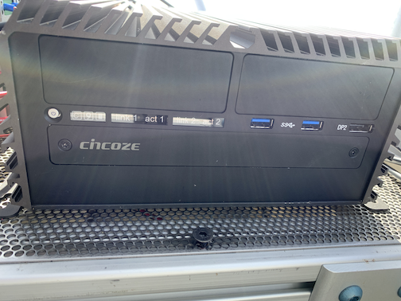

# Getting Started {.unnumbered}

This chapter describes some basic tasks related to operating the platform and how to copy data.

## Startup and Shutdown of the Platform

### Startup

To power on (start up) the instrument platform, ensure that it is plugged into AC 110-V power. Then remove the cover of the gray platform control box, and press the power button on the Cincoze computer. The image below shows the front of the Cincoze computer with the small silver power button in the upper right. Once the power button is pressed, the icon on the button should turn green.




### Shutdown

To power off (shutdown) the instrument platform, log onto the Cincoze computer using the instructions in @sec-loggingIn below and type

```
poweroff
```

Type the iceman password, if prompted. (Contact either Von or Michael for SLEIGH passwords.)

## Ethernet Access

Before connecting to the platform through the Cincoze computer, one will have to have a direct ethernet connection to the Cincoze. This may be accomplished usijg one of several different setups:

### Remote connection during Summer 2023

There are several steps to connect remotely (in summer 2023) to the platform at Summit Summit. Therefore, these steps are shown [here](remote.md).

### Skylink satellie link

TBD

### MissionLink satellite link

TBD

### Summit Station network

To connect to the Cincoze via the network at Summit Station, one must first log into local network at Summit. There are a couple of different possibilities for how to do this:

- First remotely log into another computer that is already connected to the Summit Station network (e.g., dataman).
- Connect to the local wifi network while at Summit Station.

### Verizon HotSpot

The ICECAPS-MELT project has a Verizon HotSpot that will be connected to the instrument platform when it is deployed in Boulder, Colorado. Researchers will be able to connect to this hotspot using a cellular connection and then log in to have a direct internet connection to the platform. The login credentials are:

- SSID: icecaps
- p: RavenBound

::: {.callout-warning}
    Typically one must NOT be connected to a virtual private network (VPN) when trying to access the Cincoze computer.
:::

## Logging into the Cincoze computer {#sec-loggingIn}

Once you are connected to a device that has a direct connection to the Cincoze, type the following command to SSH to the Cincoze:

```
ssh iceman@xxx.xxx.xxx.xxx
```

where xxx.xxx.xxx.xxx can be found in the following table:

| Connection | IP address      |
|------------|-----------------|
| Skylink    | ???.???.???.??? |
| MissionLink| ???.???.???.??? |
| Summit     | 192.168.98.50
| Verizon    | ???.???.???.??? |

Enter the password for the iceman account, if prompted. This should log you into the Cincoze. The Cincoze uses a Linux-based operation system, so one can issue normal Linux commands from the Cincoze prompt.

::: {.callout-warning}
    Be careful when executing Linux commands on the Cincoze computer.
:::

## Checking the System Status

The platform is operated using System Services in Linux. 

- To view all of the system services running on the Cincoze, type:

    ```
    systemctl status | less
    ```

::: {.callout-note}
    The addition of "| less" allows one to scroll up and down.
:::

- To view the status of only those processes run by the iceman user (assuming that you're logged in as iceman), type:

    ```
    systemctl --user status | less
    ```

- To view the status of a particular process, type:

    ```
    systemctl --user status mrr
    ```
    - To see a full list of the various processes running on the Cincoze to support the platform, see

## Internal Network

Once you're logged onto the Cincoze computer (iceman), you can connect to other instruments using the IP addresses listed below.
Note that these addresses are defined in /etc/hosts on iceman.

| Device                         | Local IP      | IP name       |
|--------------------------------|---------------|---------------|
| Cincoze Computer               | 192.168.1.10  | cincoze       |
| Skylink Certus Modem           | 192.168.111.1 | certus        |
| Windows VM                     | 192.168.1.166 | vm            |
| CR1000X Logger                 | 192.168.1.120 | logger        |
| Licor 7500DS Gas Analyzer      | 192.168.1.15  | licor         |
| Smart Flux                     | 192.168.1.221 |               |
| Phoenix EEM-MA370 Energy Meter | 192.168.1.32  | energymeter   |
| MODBUS relay for logger reboot | 192.168.1.97  | mvpmodbus     |
| APC power supply               | 192.168.1.11  | apc           |
| Ground Penetrating Radar       | 192.168.1.161 | gpr           |
| Metek MRR-Pro                  | 192.168.1.20  | mrr           |
| Vaisala CL61 data              | 192.168.1.111 | ceilodata     |
| Vaisala CL61 maintenance       | 172.17.0.2    | ceiloadmin    |
| Cerbo GX controller            | 192.168.1.3   | cerbo         |
| MVP Orange Pi computer         | 192.168.1.199 | mvpi          |
| RPG MW Radiometer (MWR)        | 192.168.1.77  | mwr           |

Currently, one must use the ```sshpass``` command to connect. Below is an example command to connect to the MRR from the Cincoze computer

```
sshpass -p "password-for-mrr" ssh mrruser@192.168.1.20
```

## Retrieving data

Below is a description of the data directory on the Cincoze computer and the associated data filenames. The base directory is /home/iceman/data/. The data in the sub-directories contain near data from the various platform instruments that is copied to the Cincoze in near-real time.

```
├── home
│   ├── iceman
│   │   ├── data
│   |   |   ├── asfs
│   |   |   |    ├── raw
│   |   |   |    |   ├── crd
│   |   |   |    |   |   ├── icecaps_asfs_fast_YYYYMMDDHHMM.dat 
│   |   |   |    |   |   ├── icecaps_asfs_sci_YYYYMMDDHHMM.dat 

│   |   |   ├── batts
│   |   |   |    ├── level0
│   |   |   |    |   ├── lynk_bms_candump_YYYYMMDD.log
│   |   |   |    ├── level1
│   |   |   |    |   ├── BatteryAlarms_YYYYMMDD.csv
│   |   |   |    |   ├── BatteryLimits_YYYYMMDD.csv
│   |   |   |    |   ├── BatteryMeasurements_YYYYMMDD.csv
│   |   |   |    |   ├── BatteryStatus_YYYYMMDD.csv

│   |   |   ├── blesensors
│   |   |   |    ├── ble_temperatures_YYYYMMDD.log

│   |   |   ├── cl61
│   |   |   |    ├── live_YYYYMMDD_HHMMSS.nc

│   |   |   ├── energymeter
│   |   |   |    ├── energymeter.sled.level0.1sec.YYYYMMDD.HHMMSS.nc

│   |   |   ├── mrr
│   |   |   |    ├── YYYYMM
│   |   |   |    |   ├── YYYYMMDD
│   |   |   |    |   |   ├── YYYYMMDD.log
│   |   |   |    |   |   ├── YYYYMMDD_HH0000.nc

│   |   |   ├── mwr
│   |   |   |    ├── level0
│   |   |   |    |   |   ├── YYMMDDHH.BRT
│   |   |   |    |   |   ├── YYMMDDHH.HKD
│   |   |   |    |   |   ├── YYMMDDHH.MET
│   |   |   |    |   |   ├── YYMMDDHH.BRT.NC
│   |   |   |    |   |   ├── YYMMDDHH.HKD.NC
│   |   |   |    |   |   ├── YYMMDDHH.MET.NC
│   |   |   |    ├── vmdata

│   |   |   ├── pics
│   |   |   |    ├── Allsky
│   |   |   |    |   ├── SKY_YYYYMMDD_HHMMSS.jpg
│   |   |   |    |   |   ├── small
│   |   |   |    |   |   |   ├── SKY_YYYYMMDD_HHMMSS_lowres.jpg
│   |   |   |    ├── Overview
│   |   |   |    |   ├── FAR_YYYYMMDD_HHMMSS.jpg
│   |   |   |    |   |   ├── small
│   |   |   |    |   |   |   ├── FAR_YYYYMMDD_HHMMSS_lowres.jpg
│   |   |   |    ├── Radiation
│   |   |   |    |   ├── RAD_YYYYMMDD_HHMMSS.jpg
│   |   |   |    |   |   ├── small
│   |   |   |    |   |   |   ├── RAD_YYYYMMDD_HHMMSS_lowres.jpg
│   |   |   |    ├── SLEIGHMonitor
│   |   |   |    |   ├── SLEIGH_YYYYMMDD_HHMMSS.jpg
│   |   |   |    |   |   ├── small
│   |   |   |    |   |   |   ├── SLEIGH_YYYYMMDD_HHMMSS_lowres.jpg

│   |   |   ├── power
│   |   |   |    ├── level1
│   |   |   |    |   ├── victron_cerbo_data_YYYYMMDD.csv
```

---

To sychronize data from the Cincoze computer to your local computer, one can use the Linux ```rsync``` command.

```
# Example for syncing the entire CL61 data
rsync -av --rsh=ssh iceman@192.168.98.50:/home/iceman/data/cl61/ /Users/vonw/data/icecaps/platform/cl61
```

---

To copy a subset of data from the Cincoze to your local computer, one can use ```sftp```.

```
# Example for copying energy data for a given day; single file.
rsync -av --rsh=ssh iceman@192.168.98.50:/home/iceman/data/energymeter/energymeter.sled.level0.1sec.20230517.000000.nc /Users/vonw/data/icecaps/platform/energymeter
```

::: {.callout-note}
    Note that the IP address used in the above rsync commands will vary depending on what mode of ethernet access one is using (SkyLink, MissionLink, Summit Station, Verizon Hotspot, ...)
:::

To synchonize data from instruments to the Cincoze, one can also use the ```rsync``` command, but one must include the ```sshpass``` command:

```
# Example for copying data from the MRR to the Cincoze for data archival
rsync -avz --progress --partial -e 'sshpass -p "metek" ssh' mrruser@192.168.1.20:
/media/mmcblk0p1/data/ /home/iceman/data/mrr
```