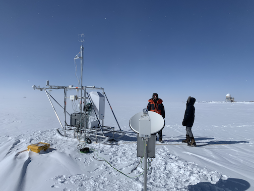

# Introduction {.unnumbered}

This documentation provides information on the instrument platform for NSF's Arctic Observing Network (AON) ICECAPS-MELT project. The Integrated Characterization of Energy, Clouds, Atmospheric state, and Precipitation at Summit (ICECAPS) is a long-term experiment that has been conducted at Summit Station, Greenland since April 2010. The MEasurements along Langrangian Transects (MELT) is the most recent sub-project of ICECAPS, which was funded for 2022-2024.

The instrument platform is called the **SLEIGH** - Surface-Layer Environmental Instruments for Greenland Hydrology.

The SLEIGH includes the following instruments:

| Instrument                          | Acronym |
|-------------------------------------|---------|
| Cincoze computer                    | Cincoze |
| Automated Surface Flux Station      | ASFS    |
| Ground Penetrating Radar            | GPR     |
| Micro Rain Radar (MRR)              | MRR     |
| Microwave Radiometer                | MWR     |
| SIMB3 thermistor string             | SIMB3   |
| Vaisala (CL61) Depolarization Lidar | CL61    |

Note that the Cincoze is the main computer system that controls the platform. All of the other instruments interface to it. In addition to controlling the platform, the Cincoze handles all of the raw data archival.

The ASFS itself is composed of a series of additional instruments:

| ASFS Instruments                    | Acronym |
|-------------------------------------|---------|
| Broadband Radiometers               | BRad    |
| Meteorological instrument (T,P,U)   | Met     |
| Metek Sonic Anemometer              | Metek   |
| Licor gas analyzer                  | Licor   |
| Global Positioning System           | GPS     |
| Flux plates                         | FPlt    |